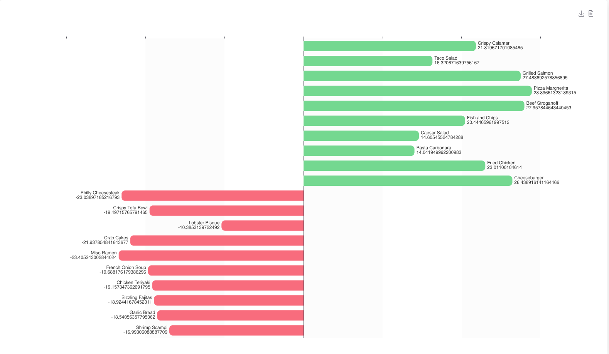

<h1 align="center">Tornado chart for Shimoku SDK</h1>
<p align="center">A reusable chart that looks like this</p>
<p align="center">
  
</p>

## Docs
The chart needs two datasets one for negative values `df_neg` and one for positive values `df_post`, that require two columns
`name` and `value`. Example:

| name          | value     |
|---------------|-----------|
| Caesar Salad  | 14.605455 |

If your datasets have other columns names, please use these parameters to indicate their names:
- For `df_neg`: `neg_col_val`, `neg_col_name`
- For `df_pos`: `pos_col_val`, `pos_col_name`

Default Echarts options can be customized by passing a dictionary, see usage example below

- options_mod: level 1 echarts options, see
https://echarts.apache.org/en/option.html

- for pos_dataops_mod and neg_dataops_mod, see
https://echarts.apache.org/en/option.html#series-bar.data

- for seriesopt_mod see
https://echarts.apache.org/en/option.html#series-bar.type

## Usage

Install dependencies first

```bash
python -m venv .venv
source .venv/bin/activate
pip install -r requirements.txt
```

```python
from tornado_chart import tornado

shimoku = Client(
    universe_id=getenv('UNIVERSE_ID'),
    access_token=getenv('API_TOKEN'),
    business_id=getenv('BUSINESS_ID'),
    verbosity='INFO',
    async_execution=True,
)

tornado(
    shimoku,
    df_neg=df_neg, df_pos=df_pos,
    # Make negative values bar blue
    neg_dataops_mod={
        'itemStyle': {
            'color': 'blue',
        },
    },
    order=0, menupath='Tornado'
)
```

Run `tornado_chart.py` as script to test it out

```bash
python tornado_chart.py
```
